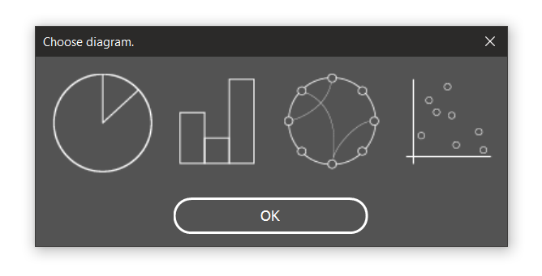

# illjs
# Data Visualization in Illustrator
Have you ever been in a situation when you want to make a custom diagram, with vector graphics, but the data were too much to analyze them yourself? This is a project for creating data visualizations in Adobe Illustrator. The scripts allow you not to waste your time on hand-drawing while keeping the diagrams ordered and precise.
The diagrams available are:
* Circular Relationship Diagram
* Barplot
* Pie
* Scatterplot


## Installation

download zip file or use

```
$ git clone https://github.com/STASYA00/illjs.git

```

## How To

The interface is very simple to use, you need to activate the plugin (File -> Scripts -> Other Scripts -> navigate to the folder and choose __main.js__; choose your csv.

Make sure your csv contains correct data, no missing values. Attention: some diagrams have not been updated to support negative values yet.

Choose the diagram you want to make:



Enjoy!


