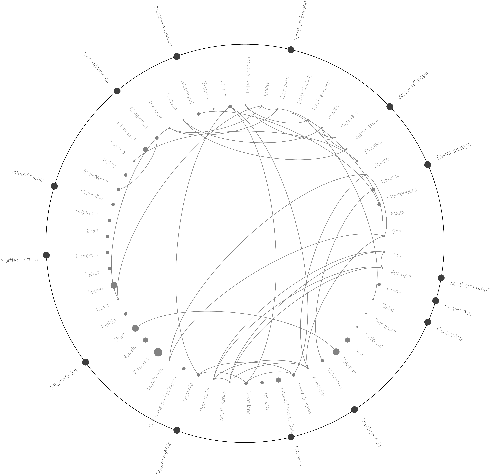
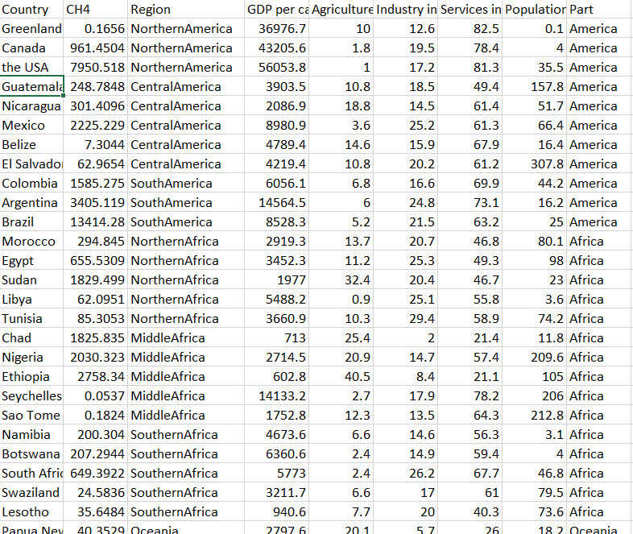
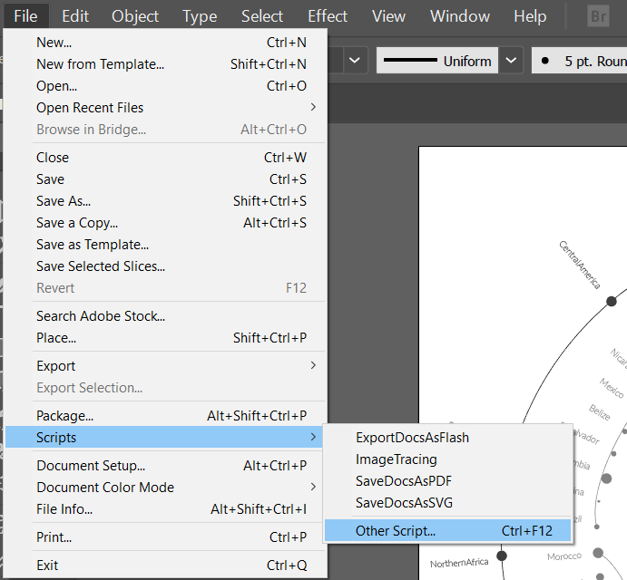
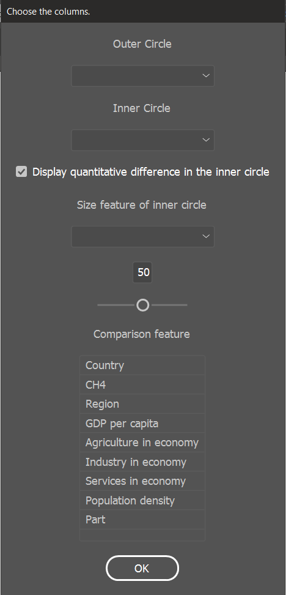
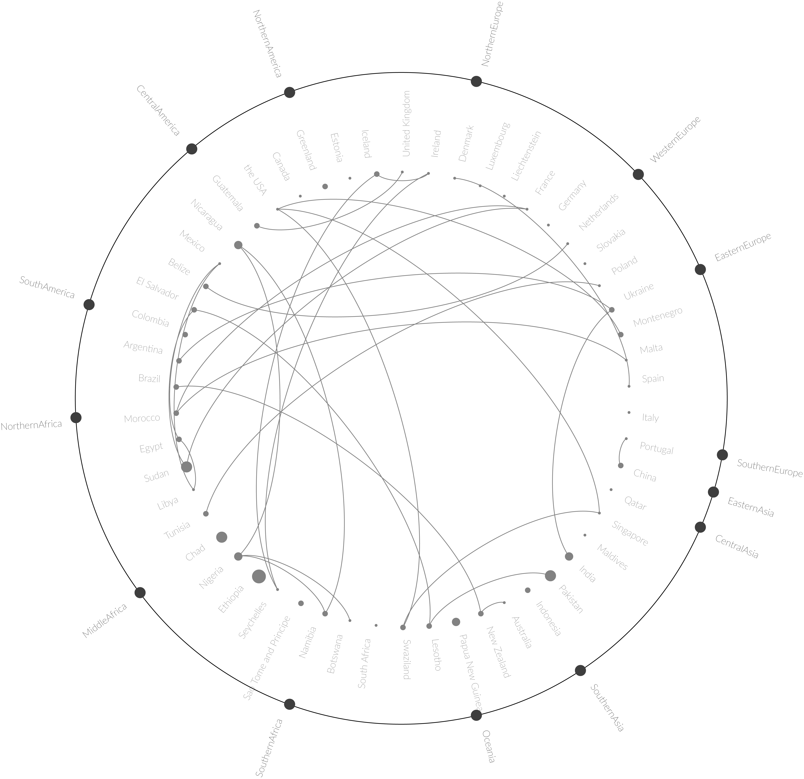

# illjs
# Data Visualization in Illustrator
Have you ever been in a situation when you want to make a custom diagram, with vector graphics, but the data were too much to analyze them yourself? This is a project for creating data visualizations in Adobe Illustrator. The scripts allow you not to waste your time on hand-drawing while keeping the diagrams ordered and precise.
The diagrams available are:
* Circular Relationship Diagram

## Installation

download zip file or use

```
git clone https://github.com/STASYA00/illjs.git

```

## Chart Diagram


The diagram consists of the following attributes:
* Category
* Subcategory
* Connection
* Size (optional)

The file is a document of size 1200x1200 px where the diagram is fit, based on the length of word elements (try to make them shorter, though). The first popup window will require a csv file, containing at least the first 3 attributes as columns. In my example I used the data of global CH4 emissions (http://www.fao.org/faostat/en/#data/EM). The csv should be structured in the following way:
* Have the required columns (category, subcategory, connection parameter);
* Rows should be grouped by category;
* Connection attribute should be numerical;
* no null or missing values.

In the csv I used the Region column is the Category, the Country is the Subcategory (a subdivision of Category) and I can use any of the numerical columns (role of agriculture in economy / GDP / CH4 / role of services in industry / etc). the first and the last rows are likely to be in the top part of the diagram, so if you would like to have a specific order, you might need to restructure the .csv file.



When the csv is ready, we can proceed directly to the diagram creation.

in Adobe Illustrator go to File -> Scripts -> Other script (I would advise you to add a shortcut for this command). In the next window go to the location of the script and choose the file 'circular_relationship_diagram.js'.



Choose your .csv file in the new window.

Right after that a pop-up prompt window appears. The process is rather intuitive: outer circle is the Category column in your csv, Inner Circle is the Subcategory column. In case you want to make an additional comparison between your samples (countries in my case), you can choose to change the size of the circles based on some value. To do that, tick the "Display quantitative difference in the inner circle" option and choose the size column. If you don't want to compare untick the "Display quantitative difference in the inner circle" and leave the selection under it empty.
Then, choose the column of comparison (numerical attribute) and the threshold value. by defining the threshold value, you set the connectivity limit: the samples that have the difference less than the threshold value will be connected (for example, I set the threshold of 0.1 and choose as the comparison column Agriculture in Economy, the countries whose values differ by 0.1 will be connected, like Namibia, Swaziland and New Zealand).



The diagram should be ready.




